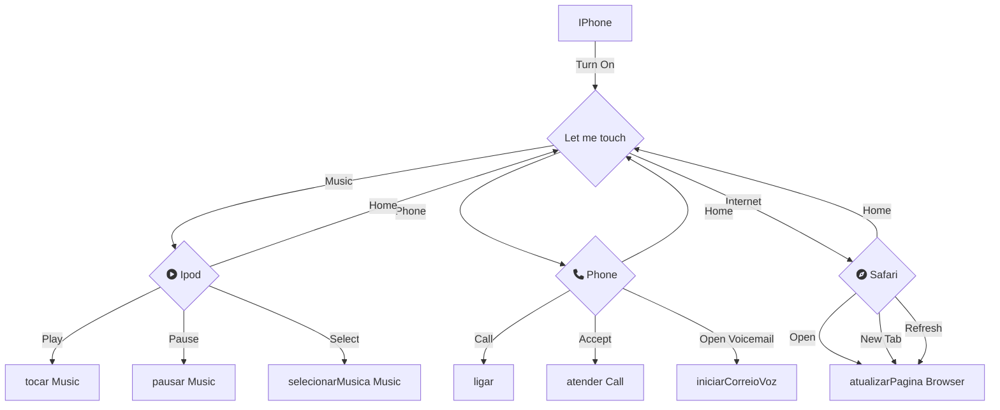

# Fluxograma do Projeto iPhone

# Descrição

Este fluxograma descreve as funcionalidades principais de um iPhone simuladas em Java. Ele inclui as seguintes operações:

### Operações

- **Turn On**: Inicializa o dispositivo.
- **Let me touch**: Exibe um menu com as opções principais.

### Music

- **Play**: Toca uma música.
- **Pause**: Pausa a música.
- **Select**: Seleciona uma música.

### Phone

- **Call**: Faz uma chamada.
- **Accept**: Atende uma chamada.
- **Open Voicemail**: Abre o correio de voz.

### Internet

- **Open**: Abre o navegador.
- **New Tab**: Abre uma nova aba no navegador.
- **Refresh**: Atualiza a página no navegador.

Cada uma dessas ações retorna ao menu principal (**Home**).

## Implementação em Java

As funcionalidades descritas no fluxograma foram implementadas em Java utilizando conceitos de Programação Orientada a Objetos (POO).

### Estrutura do Projeto

1. **Classe Principal (`Main`)**: Inicia o programa.
2. **Classe `IPhone`**: Representa o dispositivo iPhone.
3. **Classe `Ipod`**: Gerencia a reprodução de música.
4. **Classe `Phone`**: Gerencia as funções do telefone.
5. **Classe `Safari`**: Gerencia a navegação na internet.
